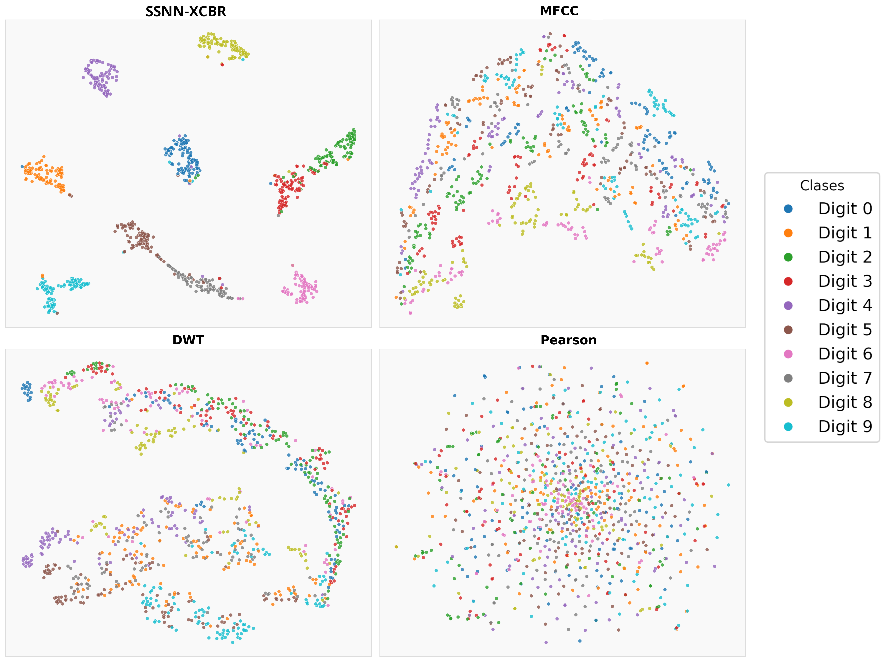
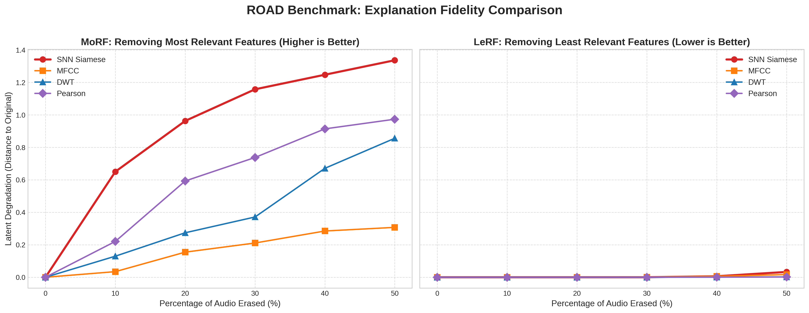
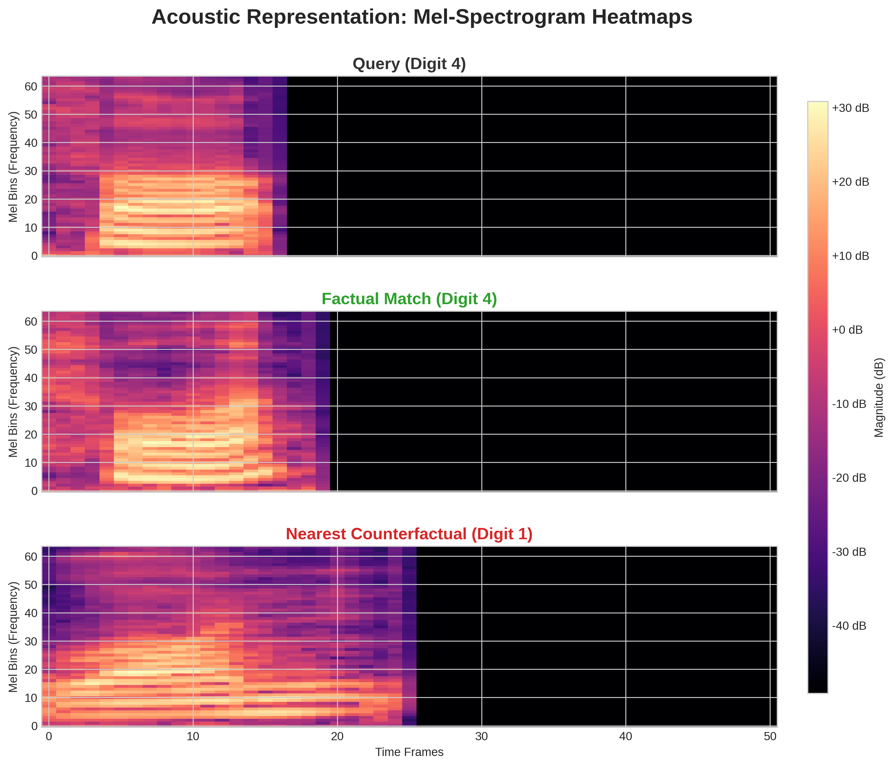

# SSNN-XCBR: A Siamese-Spiking Neural Network Architecture for Audio Case-Based Explanations

This repository contains the implementation of a **Siamese Spiking Neural Network (SSNN)** designed for robust audio retrieval and the generation of faithful factual and counterfactual explanations. Unlike traditional acoustic-based methods (e.g., MFCC), this model learns a **semantic latent space** optimized for class separability, temporal dynamics, and computational efficiency.

## Features

- **Explainable-by-Design Backbone:** `PopNetAudio` architecture utilizing **Population Coding** (class-specific expert neurons) to ensure intrinsic transparency.
- **Temporal Siamese Head:** A learned convolutional projection head that emulates biological spike-train metrics (Van Rossum distance) while maintaining Euclidean efficiency.
- **Hierarchical Representation Learning:** A custom **Hierarchical Contrastive Loss** that organizes the latent space into semantic macro-clusters (digits) and acoustic micro-clusters (speakers).
- **High Efficiency:** Real-time inference and retrieval in **~2ms**.

## Architecture

The system consists of two critical components:

1.  **Backbone (SNN):** Processes raw 1D audio waveforms into binary spike trains using LIF (*Leaky Integrate-and-Fire*) neurons. It features a hidden layer of 250 neurons divided into 10 specialized expert groups.
2.  **Siamese Projection Head:** A high-resolution temporal head that applies learned grouped convolutions ($K=25$) and adaptive pooling to generate a 512-dimensional semantic embedding.

## Results (AudioMNIST)

### Latent Space Topology (t-SNE)
Our Siamese SNN generates clearly segregated semantic "islands", significantly reducing the boundary overlap observed in MFCC. This ensures that counterfactual explanations (nearest enemies) are safe, distinct, and unambiguous.

<table>
  <tr>
    <td></td>
  </tr>
  <tr align="center">
    <td><b>TSNE Comparation</b></td>
  </tr>
</table>
### Performance Comparison Across $K$ Neighbors

| Method | T/Q (ms) | F (K=1) | CF (K=1) | F (K=3) | CF (K=3) | F. D (K=3) | CF. D (K=3) | F (K=5) | CF (K=5) | F. D (K=5) | CF. D (K=5) |
| :--- | :---: | :---: | :---: | :---: | :---: | :---: | :---: | :---: | :---: | :---: | :---: |
| SSNN-XCBR | 2.10 | 0.14 | 0.17 | 0.14 | 0.17 | 3.95 | 5.13 | 0.14 | 0.18 | 3.96 | 5.10 |
| V.R | 1709.24 | 0.13 | 0.17 | 0.13 | 0.17 | 3.82 | 5.14 | 0.13 | 0.18 | 3.86 | 5.10 |
| MFCC | 2.72 | 0.13 | 0.17 | 0.13 | 0.17 | 3.73 | 5.05 | 0.13 | 0.17 | 3.75 | 5.03 |
| DWT | 0.23 | 0.13 | 0.18 | 0.13 | 0.18 | 3.82 | 5.10 | 0.13 | 0.18 | 3.85 | 5.02 |
| Pearson | 41.33 | 0.14 | 0.17 | 0.14 | 0.17 | 4.08 | 5.02 | 0.14 | 0.18 | 4.10 | 5.03 |

> **Notes:** **T/Q**: Time per query (ms); **F**: Factual RMSE; **CF**: Counterfactual RMSE; **F.D**: Factual Diversity; **CF.D**: Counterfactual Diversity.

### ROAD Graph
<table>
  <tr>
    <td></td>
  </tr>
  <tr align="center">
    <td><b>ROAD MORF & LERF</b></td>
  </tr>
</table>

## Experiment 
The query $q$ (file $4\_41\_42$.wav) with class $cl_q = 4$, the results are:

| Factual ECs | | | Counterfactual ECs | | |
| :--- | :--- | :--- | :--- | :--- | :--- |
| **EC File** | **EC Class** | **ED** | **EC File** | **EC Class** | **ED** |
| 4_08_31.wav | 4 | 0.0152 | 1_48_20.wav | 1 | 0.8672 |
| 4_08_22.wav | 4 | 0.0252 | 5_16_1.wav | 5 | 1.0726 |
| 4_02_28.wav | 4 | 0.0275 | 2_18_15.wav | 2 | 1.2515 |

### Visual Justification

<table>
  <tr>
    <td></td>
  </tr>
  <tr align="center">
    <td><b>Mel Spectogram for Experiment</b></td>
  </tr>
</table>

---
Developed as part of the research by Pedro Antonio Martín Pelaez under the supervision of Marta Caro Martinez.
